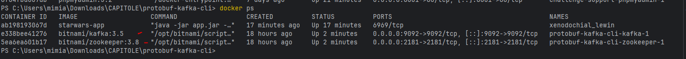
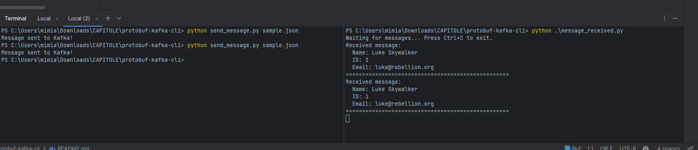

# Message Broker

This is a Python application that uses Kafka to send and receive messages encoded with Protocol Buffers (Protobuf).

---

## ✅ Features

- Python-based CLI
- Kafka as a message broker
- Protobuf for message serialization

---

## 🚀 Requirements

- Python 3.13+
- Pip (please, make sure it's added to your environment variables)
- Docker & Docker Compose for easier

---

## 🛠️ Build & Run Instructions

### 1. Install dependencies (Kafka & Protobuf)
1. Clean and build the project
```bash                  
  python -m pip install -r requirements.txt                         
```

2. Start Kafka with Docker Compose

```bash
  docker-compose up
```

You should see both containers running:

- protobuf-kafka-cli-kafka-1

- protobuf-kafka-cli-zookeeper-1

✅ Tip: Use docker ps to verify that both containers are up and running:




3. Test sending and receiving messages
Once you have both containers running I'd recommend splitting the cmd in two, or open two separate CMD/terminal windows.



Run the following command to listen for messages:

```bash
    python .\message_received.py
```

Send a message:

```bash
    python send_message.py sample.json
```
